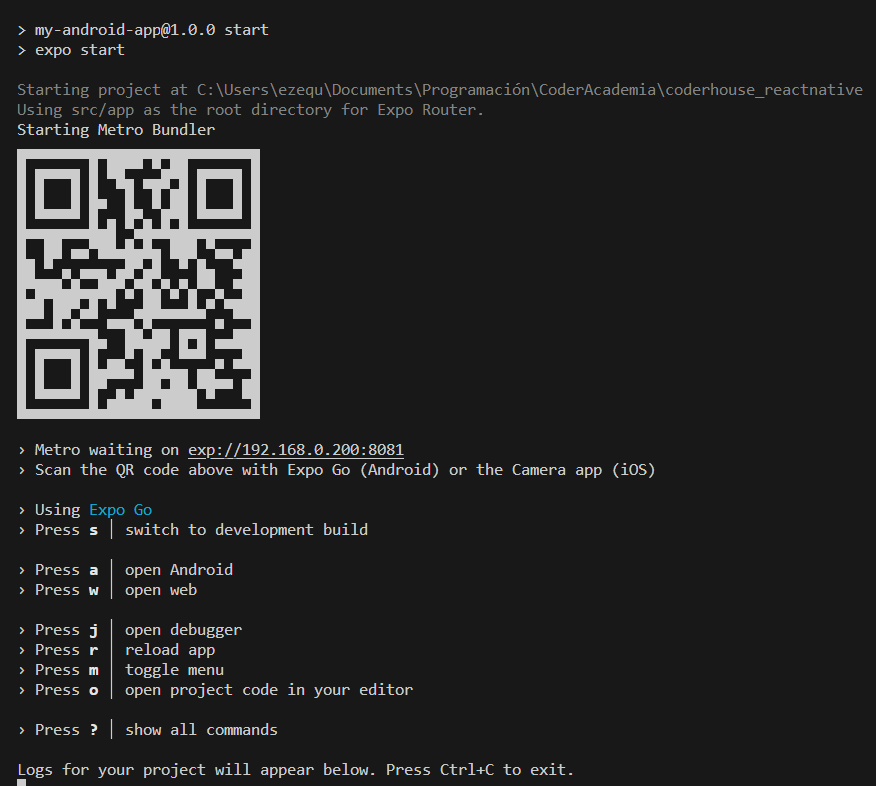
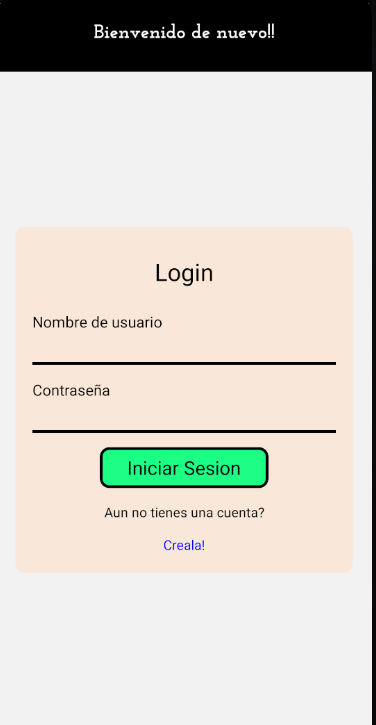
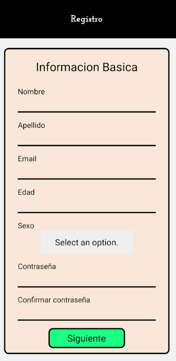

<!-- Nombre de la APP -->
# Connect-ME

## Objectivo del proyecto: 
El objetivo principal es crear una aplicación nativa de dispositivos móviles para Android y iOS que permita explorar las diferentes herramientas que provee React-Native, utilizando Expo para desarrollar an ambos sistemas operativos.

## Paquetes de node.js utilizados

+ [react-native: v0.72.6](https://www.npmjs.com/package/react-native),
+ [@react-navigation/native: v^6.0.8](https://www.npmjs.com/package/@react-navigation/native),
+ [@react-navigation/stack: v^6.0.8](https://www.npmjs.com/package/@react-navigation/stack),
+ [react-native-awesome-alerts: v^2.0.0](https://www.npmjs.com/package/react-native-awesome-alerts)
+ [react-native-bouncy-checkbox: v^3.0.7](https://www.npmjs.com/package/react-native-bouncy-checkbox)
+ [react-native-gifted-chat: v^2.4.0](https://www.npmjs.com/package/react-native-gifted-chat)
+ [react-native-maps: v1.7.1](https://www.npmjs.com/package/react-native-maps)
+ [react-native-safe-area-context: v4.6.3](https://www.npmjs.com/package/react-native-safe-area-context)
+ [react-native-screens: v~3.22.0](https://www.npmjs.com/package/react-native-screens)
+ [react-native-select-dropdown: v^3.4.0](https://www.npmjs.com/package/react-native-select-dropdown)
+ [react-native-vector-icons: v^10.0.2](https://www.npmjs.com/package/react-native-vector-icons)
+ [react-native-web: v~0.19.6](https://www.npmjs.com/package/react-native-web)
+ [react-redux: v^9.0.4](https://www.npmjs.com/package/react-redux)
+ [@expo/webpack-config: ^19.0.0](https://www.npmjs.com/package/@expo/webpack-config)
+ [@miblanchard/react-native-slider: ^2.3.1](https://www.npmjs.com/package/@miblanchard/react-native-slider)
+ [@react-native-community/datetimepicker: 7.2.0](https://www.npmjs.com/package/@react-native-community/datetimepicker)
+ [@react-navigation/bottom-tabs: ^6.5.11](https://reactnavigation.org/docs/bottom-tab-navigator/)
+ [@react-navigation/native: ^6.1.9](https://reactnavigation.org/docs/getting-started/)
+ [@react-navigation/native-stack: ^6.9.17](https://reactnavigation.org/docs/native-stack-navigator)
+ [@reduxjs/toolkit: ^2.0.1](https://redux-toolkit.js.org/introduction/getting-started)
+ [expo: v~49.0.15](https://www.npmjs.com/package/expo)
+ [expo-font: v~11.4.0](https://www.npmjs.com/package/expo-font)
+ [expo-image-picker: v~14.3.2](https://www.npmjs.com/package/expo-image-picker)
+ [expo-location: v~16.1.0](https://www.npmjs.com/package/expo-location)
+ [expo-sqlite: v~11.3.3](https://www.npmjs.com/package/expo-sqlite)
+ [expo-status-bar: v~1.6.0](https://www.npmjs.com/package/expo-status-bar)
+ [haversine-geolocation: v^1.6.0](https://www.npmjs.com/package/haversine-geolocation)
+ [socket.io-client: v^4.7.2](https://www.npmjs.com/package/socket.io-client)
+ [yup: v^1.3.3](https://www.npmjs.com/package/yup)

## Instalación del Proyecto

1. Una vez clonado el repositorio, se debe acceder a la carpeta del proyecto y ejecutar `npm install` para instalar las dependencias de NodeJS. Para poder trabajar en este proyecto es necesario contar con NodeJS y npm instalado
2. Configura las claves de API para servicios externos (Expo-Location, Firebase, GoogleApi, etc).
3. Configura las credenciales de Firebase en tu proyecto
4. A continuación iniciaremos el proyecto con el comando `npm start`, debería verse el servidor de expo corriendo localmente:



___

## Funcionalidades Pincipales

### Pantalla de Perfil

- **Acceso a los datos personales**, como nombre y correo electrónico y solo los usuarios autenticados pueden acceder a las pantallas principales de la aplicación
- **Actualización de información personal**, permitiendo cambiar información de foto de perfil, preferencias y ubicacion si así lo desea el usuario.

### Autenticación con Firebase

- Se utiliza el **sistema de autenticación** de Firebase para gestionar el **registro y logeo** por correo electrónico y contraseña de manera segura




### Pantalla de Chat (en desarrollo) 
La pantalla de chat tiene el objetivo de permitir a los usuarios enviar mensajes privados a sus matches y recibir notificaciones en tiempo real, gracias al uso de Socket.IO. Actualmente en esta pantalla solo se ve una lista de los usuarios que el actual usuario les dió "me gusta"

La pantalla de chat se basará en el componente [GiftedChat](https://www.npmjs.com/package/react-native-gifted-chat), una librería React Native para construir chats interactivos y dinámicos.

### Pantalla de inicio/feed

Esta pantalla permite a los usuarios ver una lista de otros usuarios filtrada según su ubicación geográfica, interés, género o cualquier otra configuración de filtrado que el usuario añada a su perfil. También se incluye un buscador que actualmente filtra los usuarios por nombre.

### Navegación

La aplicación utiliza la biblioteca `@react-navigation/bottom-tabs` para el manejo de pantallas, y `BottomTabNavigator` como navegador principal.

```typescript
const Tab = createBottomTabNavigator();

const TabNavigator = () => {
   
   const email = useAppSelector(state => state.auth.email)
   const {isLoading,error} = useGetUserQuery({username: email})
   
   return (
      !isLoading ? 
         <Tab.Navigator screenOptions={{
            tabBarLabelPosition: 'below-icon',
            tabBarShowLabel: true,
            tabBarStyle: styles.container ,
            tabBarLabelStyle: styles.tabLabel
         }}>
            <Tab.Screen name='home' component={Home} options={
               ()=>{
                  return {
                     tabBarIcon:  ({ color, size }) => { return <Entypo name="home" size={size*1.5} color={color} />},
                     tabBarLabel: 'Feed',
                     header: ()=> {
                        return <Header title='Connect ME' />
                     }
                  }
               }
            }>
            </Tab.Screen>
            <Tab.Screen name='chat' component={ChatScreen} options={
               ()=>{
                  return {
                     tabBarIcon:  ({ color, size }) => { return <Ionicons name="chatbubbles" size={size*1.5} color={color} />},
                     tabBarLabel: 'Chat',
                     header: ()=> {
                        return <Header title='Chat'/>
                     }
                  }
               }
            }>
            </Tab.Screen>
            <Tab.Screen name='profile' component={Profile} options={
               ()=>{
                  return {
                     tabBarIcon:  ({ color, size }) => { return <Ionicons name="person-circle-outline" size={size*1.5} color={color} />},
                     tabBarLabel: 'Perfil',
                     header: ()=> {
                        return <Header title='Profile'/>
                     }
                  }
               }
            }>
            </Tab.Screen>
            
         </Tab.Navigator>
         :
         <ActivityIndicator size="large"/>
   )
}
export default TabNavigator;
```

## Navegacion de autenticacion

La aplicación utiliza la biblioteca `@react-navigation/native-stack` para el manejo de pantallas, y `NativeStackNavigator` como navegador entre pantallas de Logeo y Registro.

```typescript
const RootStack = createNativeStackNavigator<RootStackParamList>();

const AuthNavigator = () => {
   
   return (
      <RootStack.Navigator initialRouteName='Login'>
         <RootStack.Screen name='Login' component={Login} 
            options={
               ()=>{
                  return {
                     header: ()=> {
                        return <Header title='Bienvenido de nuevo!!'/>
                     }
                  }
               }
            }
         />
         <RootStack.Screen name='RegisterNavigator' component={RegisterNavigator} 
            options={
               ()=>{
                  return {
                     header: ()=> {
                        return <Header title='Registro'/>
                     }
                  }
               }
            }
         />
      </RootStack.Navigator>
   )
}
export default AuthNavigator
```

## Navegador de registro

La aplicación utiliza la biblioteca `@react-navigation/native-stack` para el manejo de pantallas, y `NativeStackNavigator` como navegador entre las diferentes pantallas de registro, en el que se utiliza un store de `@reduxjs/toolkit` para el manejo de estado de la información del usuario.

```typescript
const RootStack = createNativeStackNavigator<RootStackRegisterParamList>();

const RegisterNavigator = ({navigation}: StackScreenProps) => {
   
   return (
      <Provider store={registerStore}>
         <RootStack.Navigator initialRouteName='MainData'
            screenOptions={{
               headerShown:false
            }}
         >
            <RootStack.Screen name='MainData'  component={MainData} options={{title:'Informacion basica'}}/>
            <RootStack.Screen name='UserHome' component={UserHome} />
            <RootStack.Screen name='GenderData' component={GenderData} />
            <RootStack.Screen name='Preferences' component={Preferences} />
            <RootStack.Screen name='Ranges' component={Ranges} />
            <RootStack.Screen name='Bio' component={Bio} />
            <RootStack.Screen name='Pictures' component={Pictures} />
            <RootStack.Screen name='Register' component={Register} />
         </RootStack.Navigator>
         
         
      </Provider>
   )
}
```

### Persistencia de datos

Se utiliza [**Firebase Realtime Database**](https://firebase.google.com/docs/reference/rest/database) para la persistencia de los datos de usuario e información de otros datos de aplicación, como orientación sexual, intereses de usuarios, etcétera.

___

## Otras tecnologias utilizadas

- **Expo-Location:** Permite acceder y gestionar la ubicación del usuario.
- **Expo-Picker-Image:** Facilita la toma y carga de imagenes de perfil de usuario.
- **Redux:** Centraliza y gestiona el estado de la aplicacion.
- **RTK Query y Firebase:** Realiza operaciones de lectura y excritura en la base de datos mediante llamados a APIs.
- **Redux-Toolkit:** Facilita la creación y gestión del store de Redux.